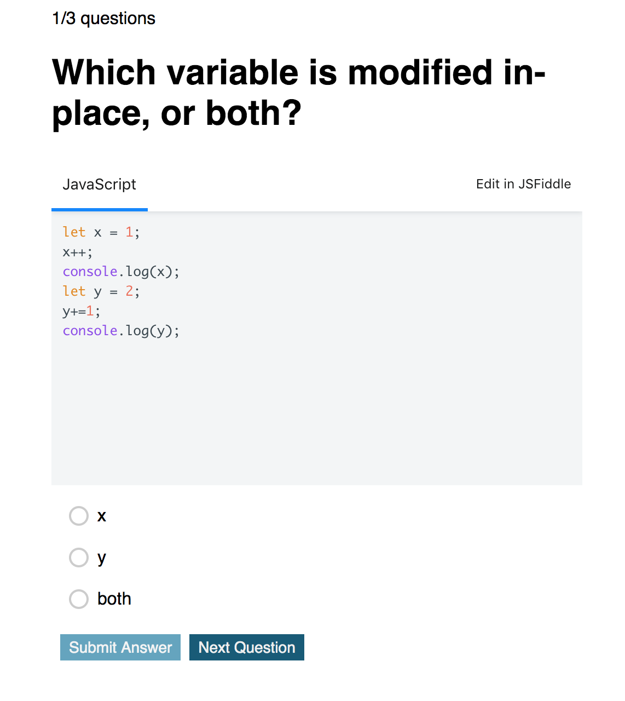

# quiz-app

LWC quiz to test your JavaScript skills!

Not only do you get a score, you can also edit and play with the questions from embedded code snippets.

You can also add your own questions in the app by modifying the JSON.

To deploy LWC Recipes Open Source to Heroku - there's a button for that.

## How to start?

Start simple by running `yarn watch` (or `npm run watch`, if you set up the project with `npm`). This will start the project with a local development server.

The source files are located in the [`src`](./src) folder. All web components are within the [`src/modules`](./src/modules) folder. The folder hierarchy also represents the naming structure of the web components.

Find more information on the main repo on [GitHub](https://github.com/muenzpraeger/lwc-create-app).
